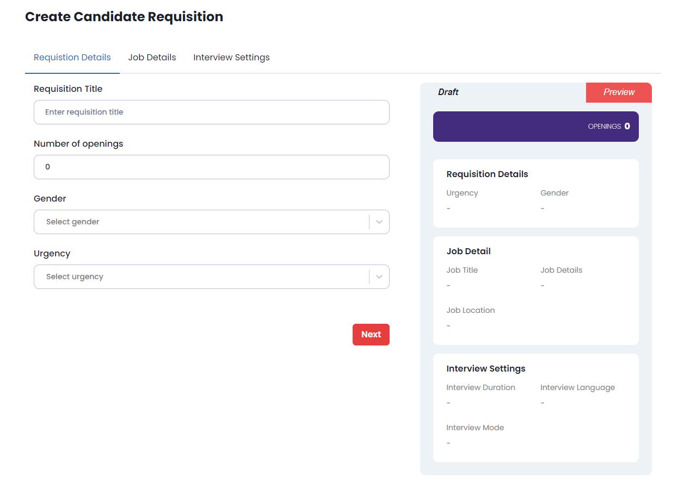

# Hiring Page

This project is a part of a larger system designed to automate the hiring process assigned to me by **The Internet Folks**. It features a multi-step form with a real-time live preview section that updates as users fill out the form.

---


---

## Technologies Used
- **Typescript**
- **Next.js (Framework)**
- **Chakra UI (Component library)**
- **Formik (Form handling)**

---

## Task
### Feature to Add
1. Values in the draft card should update in real-time based on user input in forms.
2. Validations are missing from the interview settings form, add validations in the form.

### Bug to Resolve
- On the job details form when the user submits the form it doesn’t go to the next step even when there are no errors on the screen.

### Additional Feature Added
- Add responsiveness for all screen sizes.

### Bug Left
- When clicking on the select box, the dropdown options appear, but the options box is not displayed properly. Additionally, if there are multiple select boxes on the form, clicking on an option from the second or third select box sometimes causes the focus to jump to the next input field or another select box instead of selecting the intended option. This issue occurs when the open dropdown is not the last select box on the form.

- I tried adjusting the positioning and z-index of the select box using CSS, but the issue remains same, so we need to navigate other options through up and down arrow key.

---

## How to Run This Project Locally

Follow these steps to run the application on your system:

1. Clone this repository:
```bash
git clone https://github.com/moheebk123/Hiring-Page.git
```
2. Open the cloned repository in your preferred code editor.
3. Install the necessary dependencies:

```bash
npm install
```

4. Start the development server:

```bash
npm run dev
#or
yarn dev
```

5. Open [http://localhost:3000](http://localhost:3000) with your browser to see the result.
